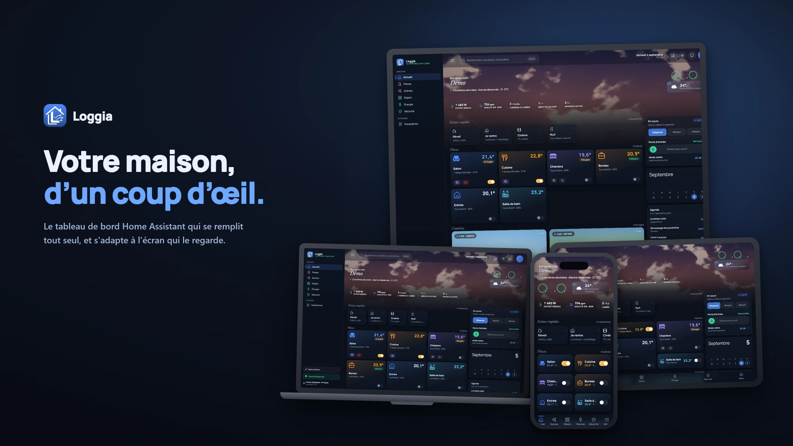

# Loggia Dashboard

[](https://github.com/Alardware/loggia/releases)
[](https://github.com/Alardware/loggia/actions)
[](https://ko-fi.com/alardware)



Un tableau de bord Home Assistant qui se remplit tout seul.

Loggia lit les registres de votre installation — zones, appareils, entités — et
en déduit ce qu'il peut afficher. Aucun identifiant d'entité n'est écrit dans le
code : ce qui n'existe pas chez vous n'apparaît pas, et ce que vous ajoutez plus
tard apparaît sans rien toucher.

Le même dashboard s'adapte à l'écran qui le regarde : sur tablette comme sur
téléphone, le bandeau du haut disparaît, la navigation passe en bas et la
barre latérale devient un tiroir. C'est le TYPE d'appareil qui décide, jamais
la largeur.

## Essayer sans rien installer

**[La démo en ligne](https://alardware.github.io/loggia/)** : rien à installer, aucune adresse à saisir. Une
maison de démonstration se monte — pièces, lumières, volets, thermostats,
agenda, scénarios, robots, **jouables** (une lampe basculée bascule) — avec
deux profils dont un administrateur pour tout essayer. Elle tourne entièrement
dans le navigateur, sans Home Assistant derrière : rien n'est envoyé nulle
part, et tout s'évapore à la fermeture de l'onglet. Un badge « Démonstration »
reste à l'écran.

Sur une installation, la même démo s'ouvre avec `?demo` sur la page directe
du dashboard — `http://<votre-ha>:8123/loggia-static/index.html?demo` — sans
lire ni écrire votre configuration. C'est aussi le banc d'essai du projet : les
branches que l'installation de l'auteur n'exerce pas se testent là.

## Installation

### Par HACS

1. HACS → Intégrations → menu ⋮ → **Dépôts personnalisés**
2. Coller `https://github.com/Alardware/loggia`, catégorie **Integration**
3. Installer **Loggia Dashboard**, puis redémarrer Home Assistant
4. Paramètres → Appareils et services → **Ajouter une intégration** → Loggia

Loggia apparaît dans le menu latéral. Il n'y a rien à configurer : ni copie dans
`www/`, ni tableau de bord YAML, ni carte iframe.

### À la main

Copier `custom_components/loggia/` dans votre dossier `config/custom_components/`,
redémarrer, puis ajouter l'intégration depuis l'interface. Le mode historique
(`loggia:` dans `configuration.yaml`) reste accepté.

**Requiert Home Assistant 2024.7 ou plus récent.**

## Ce qui est trouvé tout seul

| Vue | Source |
|---|---|
| Pièces | zones Home Assistant contenant un équipement d'ambiance |
| Lumières | domaine `light`, regroupées par zone |
| Climat | domaine `climate`, avec le capteur de température de l'appareil ou de la zone |
| Volets | domaine `cover` |
| Aspirateur, tondeuse | domaines `vacuum` et `lawn_mower` et les entités du même appareil (batterie, carte ou zones, consommables, réglages) — leur fiche s'ouvre depuis leur carte, dans Objets : accueil, carte, planning, historique, entretien |
| Médias | domaine `media_player` |
| Sécurité | `alarm_control_panel`, `camera` (flux dédoublonnés), `person` ; détecteurs pris parmi les `binary_sensor` de la même caméra |
| Énergie | **préférences du tableau de bord Énergie natif** — compteur, injection, production solaire, appareils suivis |
| Système | capteurs de charge processeur en `%`, puis mémoire, disque, température et disponibilité du même appareil |
| Scénarios | proposés par Loggia — huit, composés d'après lumières, volets, lecteurs, thermostats, alarme et serrures — plus les vôtres ; une scène ou un script (`scene`, `script`) se lie |

**Une vue sans rien à montrer disparaît du menu.** Elle réapparaît d'elle-même
le jour où l'appareil correspondant existe. Paramètres → Vues liste celles qui
sont masquées, avec le motif.

## Et sans rien configurer non plus

- **Alertes sûreté** — tout capteur binaire dont la classe désigne un danger
  (fumée, monoxyde de carbone, gaz, fuite d'eau, sabotage) pousse une
  notification rouge dès qu'il se déclenche, en tête de liste. La vigilance
  météo (MétéoAlarm) a sa notification ambre à part, portant l'événement réel.
- **Journal d'activité par pièce** — sous les appareils d'une pièce, les
  dernières 24 heures : qui s'est allumé, ouvert, verrouillé, à quelle heure.
  Alimenté par le logbook de Home Assistant, poussé en direct.
- **Le côté de l'Accueil, prêt à l'emploi** — « À surveiller » en tête quand
  quelque chose le mérite, l'heure, la météo, la carte CO₂ (la pièce la plus
  chargée, une barre par heure sur vingt-quatre heures, le seuil d'aération,
  et le geste pour aérer quand il y a quelque chose à commander), En ce
  moment, le calendrier. Chaque bloc se retire, se range ou revient en mode
  édition.
- **Des capteurs lisibles d'un coup d'œil** — la carte d'un capteur de CO₂,
  de température, d'humidité ou de bruit porte une jauge à paliers, du bleu
  (l'idéal) au rouge, et un trait à la valeur ; une pile, cinq barres. Toutes
  les piles de la maison se retrouvent dans la vue Énergie, la plus basse
  d'abord.
- **Caméras en direct** — le flux sur l'Accueil et dans la vue Sécurité.
  Un clic sur une vignette l'ouvre en grand, avec les modes de la caméra
  (détection, suivi, mode privé) quand l'appareil en propose. De deux
  caméras, un menu règle combien s'affichent par ligne — de une à quatre,
  chacune avec son schéma —, et le choix est propre à l'ordinateur, à la
  tablette et au téléphone.
- **Vignette météo animée** — la condition se voit dans la vignette de
  l'accueil : pluie qui tombe, étoiles, halo de soleil, éclair d'orage.
- **Mode ambiant** — pour une tablette murale : après un délai sans toucher,
  un écran de veille sombre — heure en grand, météo, lumières allumées,
  alarme, alertes. Un toucher le retire, on retrouve l'écran où on l'avait
  laissé.
- **Chip « n allumées »** dans l'en-tête, visible de partout ; un clic ouvre
  la vue Lumières.
- **Français et anglais** — les états et commandes viennent de Home Assistant
  dans toutes ses langues ; changer de langue est immédiat, sans rechargement.

## Vues personnalisées et cartes template

Une vue custom se compose depuis l'interface (admin) : des entités — chaque
domaine a sa carte générique — et des **cartes template**, dont le contenu est
un template Jinja évalué par Home Assistant et mis à jour en direct dès qu'une
entité référencée change. N'importe quelle donnée calculable devient
affichable, sans YAML.

## Apparence

Thèmes clair et sombre, préréglages (dont un rendu « verre » avec flou
d'arrière-plan), **teinte d'état** réglable — les cartes actives se lavent de
leur couleur : lampe allumée dorée, volet ouvert à l'accent, chauffage qui
rougeoie — et **fonds d'écran** discrets dans la palette du thème. Le mode
« Suivre Home Assistant » calque le thème actif de HA. Tous ces réglages sont
propres à l'appareil.

Si le pire arrive, l'écran d'erreur propose de **repartir sans les vues
custom** ou de revenir aux **réglages d'usine** — le dashboard sait se
réparer.

## Ce qui demande une configuration

Tout n'a pas d'équivalent standard dans Home Assistant. Ces éléments se
désignent sur la page concernée : passez en **mode édition**, puis ouvrez
**Entités de la vue** dans le bandeau du haut (Accueil, Objets, Énergie,
Sécurité) :

- les radiateurs **fil pilote** — un `switch` entouré d'aides (consigne, mode,
  automatique) qu'aucune convention ne permet de deviner ;
- le **planning des volets** (mode d'automatisme, jours) ;
- un **distributeur de croquettes** piloté par automations ;
- les capteurs d'énergie d'un package maison, si vous préférez les vôtres à ceux
  que le tableau de bord Énergie expose.

## Où sont vos réglages

Dans `.storage/loggia_dashboard_config`, **par utilisateur Home Assistant** :
chacun garde ses pièces, son thème et ses vues, sur tous ses appareils. C'est
l'intégration qui écrit ce fichier, via des commandes WebSocket authentifiées —
l'identité vient de la connexion, jamais du navigateur.

Sans l'intégration, le dashboard retombe sur le `localStorage` du navigateur :
les réglages restent, mais ne suivent plus d'un appareil à l'autre.

## Trois niveaux, pas dix

Tout ce qui a un état parle la même langue. Normal : discret, dans la couleur
du texte. Attention : ambre, visible, sans clignoter — une pile à 20 %, un
CO₂ « élevé » (1 400 ppm), un ouvrant ouvert alarme armée. Action nécessaire :
rouge, lavis, point qui bat, bandeau — l'alarme déclenchée, la fumée, une pile
à 5 %, Home Assistant perdu. Les mêmes seuils partout (pièce, rail, point
d'attention, veille du serveur), et les couleurs viennent du thème : le mode
clair reste lisible. Les jauges des capteurs montrent, elles, l'échelle
entière — cinq couleurs, de l'idéal au trop —, tirées de la même table de
seuils que la barre de confort des pièces.

## Sécurité

- Les appels de service passent par l'API standard de Home Assistant, avec
  **ses** autorisations : Loggia n'ajoute aucun filtre par-dessus, et n'en
  retire aucun. Un compte ne peut donc rien faire ici qu'il ne puisse déjà
  faire ailleurs dans Home Assistant.
- Les commandes qui écrivent la configuration de la maison sont **réservées
  aux administrateurs** (`require_admin`, sur les sept commandes WebSocket
  concernées). L'identité vient de la connexion authentifiée, jamais d'un
  champ envoyé par le navigateur.
- Les automatisations n'appellent que des services **écrits en dur** dans le
  composant (`cover.open_cover`, `climate.set_hvac_mode`…) : seule la cible
  est configurable. Seuls les boutons sans fil font exception, et leur
  affectation demande d'être administrateur.
- Le jeton d'accès Home Assistant est lu **à un seul endroit** : pour
  authentifier les images de caméra auprès du proxy de Home Assistant. Il
  n'est ni stocké, ni envoyé ailleurs.
- Le code PIN administrateur suit la maison depuis le 03/09 : il est
  enregistré côté serveur avec le reste de la configuration, et non plus
  seulement sur l'appareil. C'est ce qui permet de le retrouver sur un autre
  écran.
- Aucune ressource externe : ni CDN, ni police distante, ni télémétrie.

## Développement

```bash
npm install
npm test           # disponibilité des vues, sur installations synthétiques
npm run lint       # variables non définies, règles des hooks React
npm run build      # construit dans dist/

pip install pytest
python -m pytest tests/python -q   # stockage de la configuration
```

Les tests Python posent leurs propres doublures de Home Assistant : ils tournent
sans l'installer, et la suite ne se fige pas sur une version.

Le frontend est du React + Vite, compilé avec `base: './'` — le dossier
`custom_components/loggia/frontend/` est donc servable sous n'importe quel
préfixe d'URL.

Le moteur de règles a son vocabulaire et ses décisions : `docs/GLOSSAIRE.md`
et `docs/decisions/` — une décision par fichier, avec son contexte.

## Soutenir

Loggia est développé sur mon temps libre, pour ma maison d'abord — et partagé
parce qu'il peut servir la vôtre. Si le projet vous est utile, un café aide à
le faire vivre :

[](https://ko-fi.com/alardware)

## Licence

MIT — voir [LICENSE](LICENSE).
