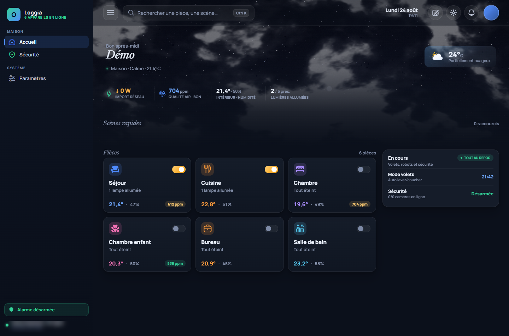
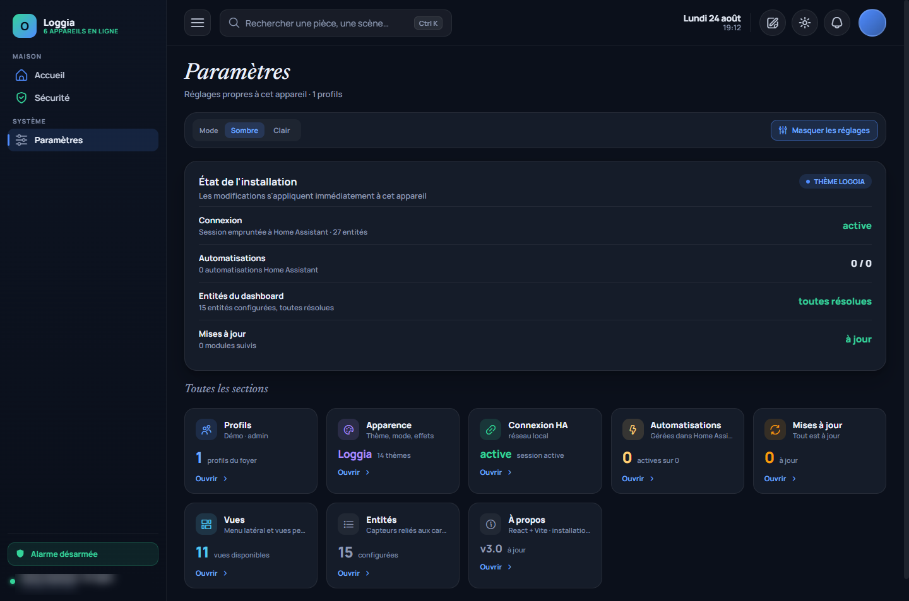

# Loggia Dashboard

[](https://github.com/Alardware/loggia/releases)
[](https://github.com/Alardware/loggia/actions)
[](https://ko-fi.com/alardware)

Un tableau de bord Home Assistant qui se remplit tout seul.

Loggia lit les registres de votre installation — zones, appareils, entités — et
en déduit ce qu'il peut afficher. Aucun identifiant d'entité n'est écrit dans le
code : ce qui n'existe pas chez vous n'apparaît pas, et ce que vous ajoutez plus
tard apparaît sans rien toucher.



Les réglages, où chaque section indique ce qu'elle a trouvé et ce qui manque :



> Ces captures viennent d'une maison de démonstration, pas d'une installation
> réelle : six pièces, quelques capteurs, aucune caméra — de quoi montrer le
> rendu sans exposer le domicile de qui que ce soit.

## Essayer sans rien installer

Ouvrez la page directe du dashboard avec `?demo` :

```
http://<votre-ha>:8123/loggia-static/index.html?demo
```

La maison de démonstration se monte : pièces, lumières, volets, thermostats,
agenda, scènes — **jouables** (une lampe basculée bascule), deux profils dont
un administrateur pour tout essayer. Aucune trace : le stockage du navigateur
est remplacé par un magasin en mémoire, votre configuration n'est ni lue ni
écrite, et tout s'évapore à la fermeture de l'onglet. Un badge
« Démonstration » reste à l'écran.

C'est aussi le banc d'essai du projet : les branches que l'installation de
l'auteur n'exerce pas — un compte administrateur, une maison sans caméras —
se testent là.

## Installation

### Par HACS

1. HACS → Intégrations → menu ⋮ → **Dépôts personnalisés**
2. Coller `https://github.com/Alardware/loggia`, catégorie **Integration**
3. Installer **Loggia Dashboard**, puis redémarrer Home Assistant
4. Paramètres → Appareils et services → **Ajouter une intégration** → Loggia

Loggia apparaît dans le menu latéral. Il n'y a rien à configurer : ni copie dans
`www/`, ni tableau de bord YAML, ni carte iframe.

### À la main

Copier `custom_components/loggia/` dans votre dossier `config/custom_components/`,
redémarrer, puis ajouter l'intégration depuis l'interface. Le mode historique
(`loggia:` dans `configuration.yaml`) reste accepté.

**Requiert Home Assistant 2024.7 ou plus récent.**

## Ce qui est trouvé tout seul

| Vue | Source |
|---|---|
| Pièces | zones Home Assistant contenant un équipement d'ambiance |
| Lumières | domaine `light`, regroupées par zone |
| Climat | domaine `climate`, avec le capteur de température de l'appareil ou de la zone |
| Volets | domaine `cover` |
| Aspirateur | domaine `vacuum` et les entités du même appareil (batterie, carte, surface, durée) |
| Médias | domaine `media_player` |
| Sécurité | `alarm_control_panel`, `camera` (flux dédoublonnés), `person` ; détecteurs pris parmi les `binary_sensor` de la même caméra |
| Énergie | **préférences du tableau de bord Énergie natif** — compteur, injection, production solaire, appareils suivis |
| Système | capteurs de charge processeur en `%`, puis mémoire, disque, température et disponibilité du même appareil |
| Scènes | domaines `scene` et `script` |

**Une vue sans rien à montrer disparaît du menu.** Elle réapparaît d'elle-même
le jour où l'appareil correspondant existe. Paramètres → Vues liste celles qui
sont masquées, avec le motif.

## Et sans rien configurer non plus

- **Alertes sûreté** — tout capteur binaire dont la classe désigne un danger
  (fumée, monoxyde de carbone, gaz, fuite d'eau, sabotage) pousse une
  notification rouge dès qu'il se déclenche, en tête de liste. La vigilance
  météo (MétéoAlarm) a sa notification ambre à part, portant l'événement réel.
- **Journal d'activité par pièce** — sous les appareils d'une pièce, les
  dernières 24 heures : qui s'est allumé, ouvert, verrouillé, à quelle heure.
  Alimenté par le logbook de Home Assistant, poussé en direct.
- **Vignette météo animée** — la condition se voit dans la vignette de
  l'accueil : pluie qui tombe, étoiles, halo de soleil, éclair d'orage.
- **Mode ambiant** — pour une tablette murale : après un délai sans toucher,
  un écran de veille sombre — heure en grand, météo, lumières allumées,
  alarme, alertes. Un toucher le retire, on retrouve l'écran où on l'avait
  laissé.
- **Chip « n allumées »** dans l'en-tête, visible de partout ; un clic ouvre
  la vue Lumières.
- **Français et anglais** — les états et commandes viennent de Home Assistant
  dans toutes ses langues ; changer de langue est immédiat, sans rechargement.

## Vues personnalisées et cartes template

Une vue custom se compose depuis l'interface (admin) : des entités — chaque
domaine a sa carte générique — et des **cartes template**, dont le contenu est
un template Jinja évalué par Home Assistant et mis à jour en direct dès qu'une
entité référencée change. N'importe quelle donnée calculable devient
affichable, sans YAML.

## Apparence

Thèmes clair et sombre, préréglages (dont un rendu « verre » avec flou
d'arrière-plan), **teinte d'état** réglable — les cartes actives se lavent de
leur couleur : lampe allumée dorée, volet ouvert à l'accent, chauffage qui
rougeoie — et **fonds d'écran** discrets dans la palette du thème. Le mode
« Suivre Home Assistant » calque le thème actif de HA. Tous ces réglages sont
propres à l'appareil.

Si le pire arrive, l'écran d'erreur propose de **repartir sans les vues
custom** ou de revenir aux **réglages d'usine** — le dashboard sait se
réparer.

## Ce qui demande une configuration

Tout n'a pas d'équivalent standard dans Home Assistant. Ces éléments se
désignent dans **Paramètres → Entités** :

- les radiateurs **fil pilote** — un `switch` entouré d'aides (consigne, mode,
  automatique) qu'aucune convention ne permet de deviner ;
- le **planning des volets** (mode d'automatisme, jours) ;
- un **distributeur de croquettes** piloté par automations ;
- les capteurs d'énergie d'un package maison, si vous préférez les vôtres à ceux
  que le tableau de bord Énergie expose.

## Où sont vos réglages

Dans `.storage/loggia_dashboard_config`, **par utilisateur Home Assistant** :
chacun garde ses pièces, son thème et ses vues, sur tous ses appareils. C'est
l'intégration qui écrit ce fichier, via des commandes WebSocket authentifiées —
l'identité vient de la connexion, jamais du navigateur.

Sans l'intégration, le dashboard retombe sur le `localStorage` du navigateur :
les réglages restent, mais ne suivent plus d'un appareil à l'autre.

## Sécurité

- Les appels de service passent par `/api/loggia/call`, protégé par une
  **liste blanche fermée par défaut** : un domaine absent de la liste est
  refusé. `shell_command`, `python_script`, `hassio`, `recorder`, `backup` et
  `homeassistant.restart` n'y figurent pas.
- Le code **ne lit jamais** votre jeton d'accès Home Assistant et ne demande
  aucun identifiant.
- Le code PIN administrateur reste sur l'appareil : il n'est jamais envoyé au
  serveur (`FORBIDDEN_KEYS`, dans `store.py`, le refuse à l'écriture).
- Aucune ressource externe : ni CDN, ni police distante, ni télémétrie.

## Développement

```bash
npm install
npm test           # disponibilité des vues, sur installations synthétiques
npm run lint       # variables non définies, règles des hooks React
npm run build      # construit dans dist/

pip install pytest
python -m pytest tests/python -q   # stockage de la configuration
```

Les tests Python posent leurs propres doublures de Home Assistant : ils tournent
sans l'installer, et la suite ne se fige pas sur une version.

Le frontend est du React + Vite, compilé avec `base: './'` — le dossier
`custom_components/loggia/frontend/` est donc servable sous n'importe quel
préfixe d'URL.

## Soutenir

Loggia est développé sur mon temps libre, pour ma maison d'abord — et partagé
parce qu'il peut servir la vôtre. Si le projet vous est utile, un café aide à
le faire vivre :

[](https://ko-fi.com/alardware)

## Licence

MIT — voir [LICENSE](LICENSE).
